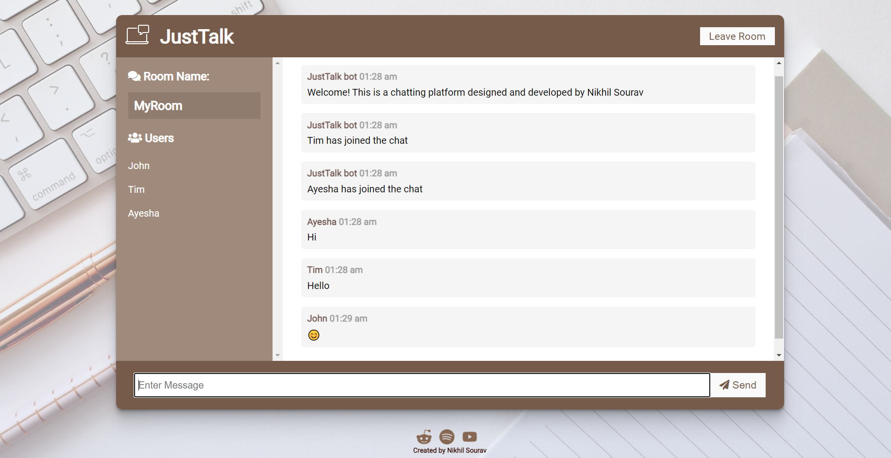

# JustTalk

[JustTalk](http://chat-app-by-nikhilsourav.herokuapp.com/) is a real-time chat app with multiple chatting room and group chat support.

## Demo:

- Landing page:

    

- Chat room:

    

## About this app:

Tech used:

- [nodejs](https://nodejs.org/en/)
- [expressjs](https://expressjs.com/)
- [socket.io](https://socket.io/)

Features:

- Upto 10,000 user can join a private room.
- Separate landing page where user can choose their username and the private room to join in.
- Notifications of a user action like entering or leaving a room is updated constantly.
- Inside a room, each user's name is displayed in a separate panel.
- Full emoji support.
- Custom css.
